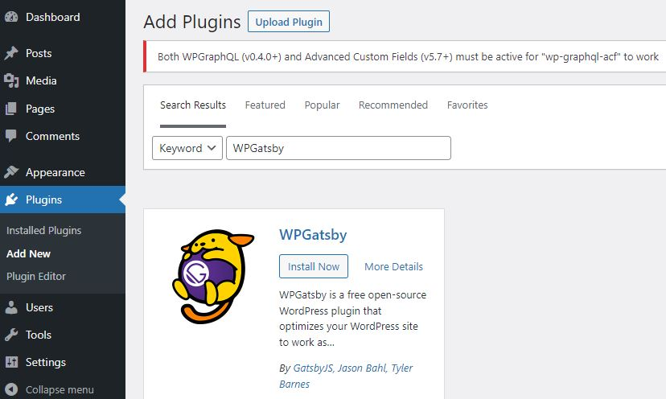
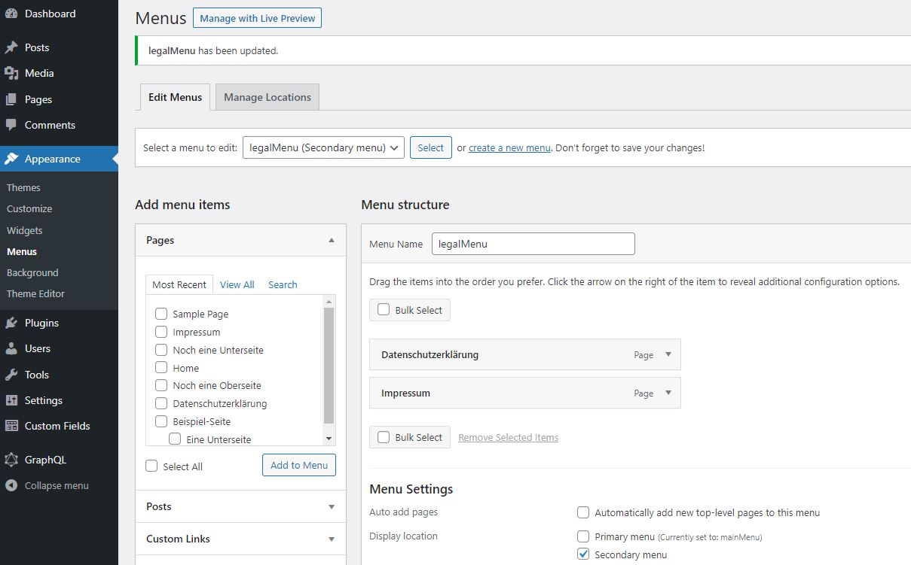
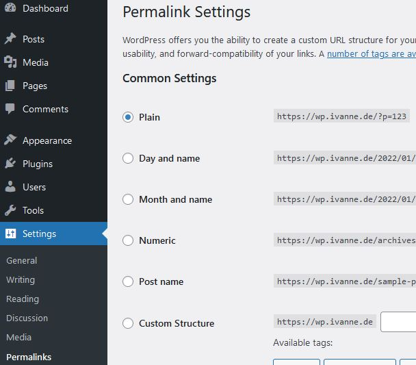
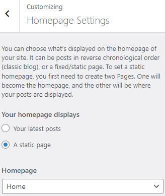
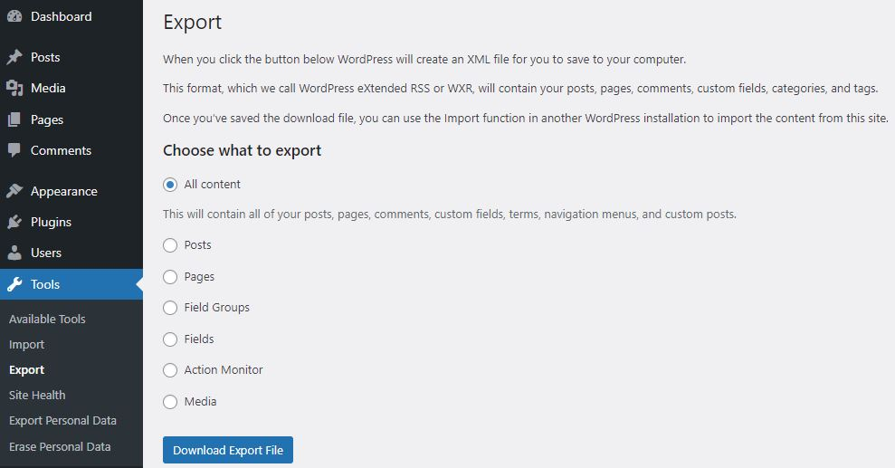
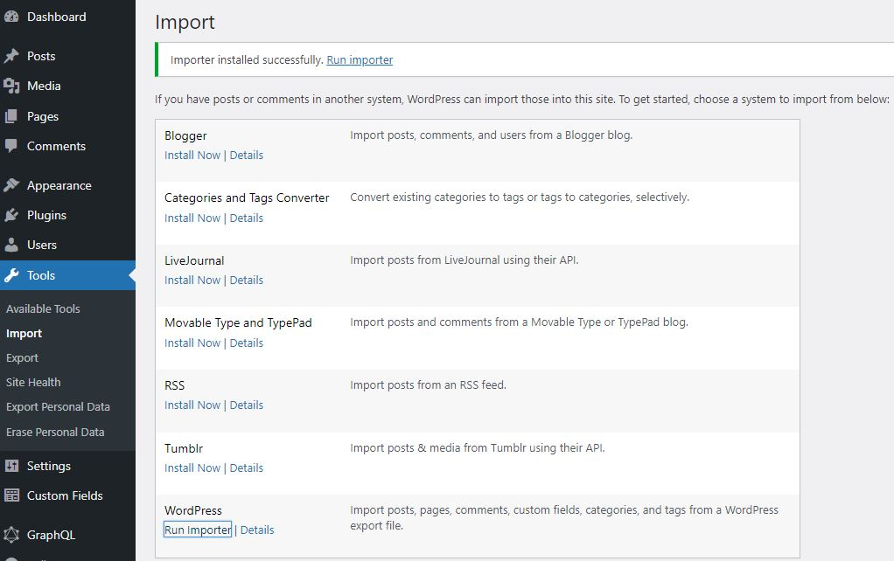

# wp-gatsby-docker

## Setup

**OS: *Ubuntu Focal***

```shell
sudo apt update
sudo apt upgrade
sudo apt install git
sudo apt install docker docker-compose
cd
git clone https://github.com/iThijssen/wp-gatsby-docker.git
cd ~/wp-gatsby-docker
chmod +x siteserver/scripts/*
# keep permissions after pull (executable bits get lost (due to compression?))
nano .git/hooks/post-merge
```

`.git/hooks/post-merge`:

```bash
#!/bin/sh
chmod +x siteserver/scripts/*
```

```shell
chmod +x .git/hooks/post-merge
nano .env
```
```
HTTP=80
HTTPS=443
MYSQL_USER=wordpress
MYSQL_PASSWORD=wordpress
MYSQL_ROOT_PASSWORD=somewordpress
SMTP_PW=Ch4ng3Me
NGINX_CONF=nginx-no-ssl.conf
WEBHOOK_KEY=the-value-of-your-environment-variable-WEBHOOK_KEY
```

In `.env`, replace the values of `MYSQL_ROOT_PASSWORD`, `SMTP_PW` and `WEBHOOK_KEY`.
For `WEBHOOK_KEY` you can use this command:

```shell
date +%s | sha256sum | base64 | head -c 32 ; echo
```

Also replace the values of `from` and `smtp_url` 
in `siteserver/Dockerfile`, under `# automail`.
`SMTP_PW` is the password of your mail-server.

## Start

Depending on the host machine and the permissions you configured, 
you may have to remove `sudo` in front of following commands.

For testing purposes, you can omit the option `-d` 
to keep the logs in foreground.

Here, the instance is being named `wp-stack`:

```shell
sudo docker-compose -p wp-stack up -d
```

### WP Installation

Install *WordPress* in the browser at `/wp-admin/install.php`.

---

### Restart

If you have to clean restart the Docker instance, first backup and then:

```shell
sudo docker-compose -p wp-stack down
sudo docker system prune -a --volumes
sudo docker-compose -p wp-stack up --build -d
```

### Verify

List current data:

```shell
sudo docker ps -a
sudo docker images
sudo docker volume ls
sudo docker volume inspect <volume_id>
```

### Upgrade

Sorry, I do not have any good solution yet.
You may have a look at this question:
https://stackoverflow.com/questions/26423515/how-to-automatically-update-your-docker-containers-if-base-images-are-updated

### Update

To deploy a new version, download the new code and recreate the instance.
If you changed the `website` only, just add the service:

```shell
git pull
sudo docker-compose -p wp-stack up --build -d website
```

Inside the site-server:

```shell
sudo docker-compose -p wp-stack exec website bash
```

You may have to debug, e.g. remove the cache and rebuild the "sharp" module:

```shell
cd /home/site/
npm run clean
npm rebuild --verbose sharp
```

And check the logfile of the cronjob:

```shell
cat /var/log/build.log
```

---

## SSL

Once you followed the [certificate-instructions](siteserver/proxy/instructions/howto_cert.md),
set the environment-variable `NGINX_CONF` to `nginx.conf`.

In the browser, go to `/wp-admin/options-general.php` and edit the URLs:


Recreate the stack:

```shell
sudo docker-compose -p wp-stack up --build -d
```

You may have to clear the cache and reopen the browser.

### Database

To connect to the MySQL-server:

```shell
sudo docker-compose -p wp-stack exec db bash
```

#### Demo

```
/# mysql -u root -p
mysql> show databases;
mysql> show tables from wordpress;
mysql> use wordpress;
mysql> show columns from wp_users;
mysql> show user_url from wp_users;
mysql> update wp_users set user_url = 'https://wp.ivanne.de';
mysql> quit
```

## Plugins

#### WPGraphQL for Advanced Custom Fields

> Adds Advanced Custom Fields to the WPGraphQL Schema
> (Version 0.5.3 | By WPGraphQL, Jason Bahl)

The ZIP-file to upload can be found here:
https://github.com/wp-graphql/wp-graphql-acf#install-and-activate

If the size exceeds 5M, increase the values here:

- `siteserver/proxy/conf/uploads.ini`
- `siteserver/proxy/conf/nginx-no-ssl.conf` client_max_body_size
- `siteserver/proxy/conf/nginx.conf` client_max_body_size

#### WP Gatsby



> Optimize your WordPress site to be a source for Gatsby sites.
> (Version 2.1.1 | By GatsbyJS, Jason Bahl, Tyler Barnes)

#### Advanced Custom Fields

> Customize WordPress with powerful, professional and intuitive fields.
> (Version 5.11.4 | By Delicious Brains)

#### WP GraphQL

> GraphQL API for WordPress
> (Version 1.6.10 | By WPGraphQL)

### GraphQL

https://wp.ivanne.de/graphql leads to 404, so correct the endpoint:

`gatsby-config.js`:

```js
...
    {
      resolve: `gatsby-source-wordpress`,
      options: {
        url: `https://wp.ivanne.de/index.php?graphql`,
      },
    },
...
```

#### Menus

Every slug has to be unique and must not begin with "wp-".

If a category has to be a menu-item, 
the slug has to be the slug-version of the label
and any change has to be saved in the menu-settings as well.


*mainMenu* & *legalMenu*:



#### Links

I tried to change the permalinks-structure but following error occured while updating a page:

> Updating failed. The response is not a valid JSON response.

So I changed the settings back to **Plain**:



#### Homepage

`/wp-admin/customize.php`:



## Webhook

Every update in the CMS should be published on the static website within seconds (or 2 minutes).
In order for the cronjob to trigger a rebuild,
set the **Builds Webhook URL** in **Settings > GatsbyJS**, but don't forget to append the secret key.
So you have to pass your `WEBHOOK_KEY` as value of parameter `k`.

Example URL: https://wp.ivanne.de/webhook.php?k=the-value-of-your-environment-variable-WEBHOOK_KEY

## Migration

#### Export



#### Import

There is no guaranty that everything can be imported. But you can try:




# Test

Never forget Edge.